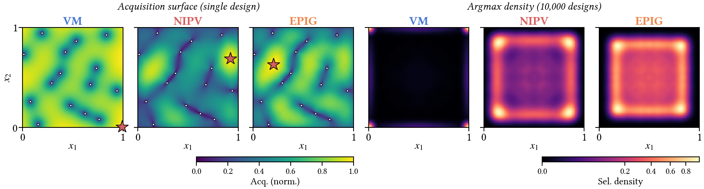

# Boundary Variance Inflation Causes Acquisition Bias in Gaussian Processes

Code to reproduce the paper *"Boundary Variance Inflation Causes Acquisition
Bias in Gaussian Processes."*

<p align="center">
  
</p>

## What this shows

A Gaussian process's posterior variance is inflated near the boundary of its
input domain: a point next to a wall has fewer in-domain neighbours, so the
kernel's correlation neighbourhood is truncated and the variance stays high.
This is a property of the kernel, the domain, and the training locations alone.
It does not depend on the observed function values.

Acquisition functions that reward posterior uncertainty inherit the effect.
The paper isolates it across three variance-driven acquisition classes and
shows where each one places its next point, using a function-free diagnostic:

- **VM** (variance maximization, the exploration term shared by EIG and GP-UCB)
  concentrates selections at the corners of the cube.
- **NIPV** (negative integrated posterior variance) prefers an interior shell
  near, but not on, the boundary.
- **EPIG** (expected predictive information gain) prefers a shell further inside.

The bias persists across dimension and lengthscale, reappears in full
sequential acquisition on real test functions, drives early Bayesian
optimization with UCB, and is only partially corrected by a Neumann
(mirror-image) kernel. This is a **diagnosis-only** repository: it characterizes
the mechanism and does not propose a complete remedy.

## Repository layout

```
src/          reusable code: kernels, GP posterior, acquisitions, diagnostic,
              test functions, plotting style
experiments/  compute scripts -> write results/*.npz
figures/      plot scripts -> read results/, write figs/*.png
notebooks/    tutorial.ipynb, a short walkthrough of the mechanism
figs/         the paper's figures (also the regeneration target)
```

The diagnostic GP posterior, kernels, and acquisitions are implemented from
scratch in `src/` with PyTorch and NumPy. There is no dependency on any larger
Bayesian-optimization framework.

## Installation

```bash
pip install -r requirements.txt
```

Requires Python 3.9+ with PyTorch, GPyTorch, NumPy, SciPy, matplotlib, and
seaborn. A GPU is used automatically if available but is not required.

## Quickstart

Open the tutorial for a short walkthrough (1D mechanism, the 2D argmax bias,
and the selection diagnostic):

```bash
jupyter notebook notebooks/tutorial.ipynb
```

## Reproducing the figures

Each figure has a compute step (writes `results/`) and a plot step (writes
`figs/`). The compute scripts accept `--n-seeds` (and the sweep accepts
`--dims`) for quick smoke tests; the defaults reproduce the paper.

The full runs are not quick. At its 1000-seed default `compute_sweep.py` takes
on the order of an hour and dominates the total; the 2D-surface and sequential
runs take a few minutes each. To check the pipeline end to end first, run a
compute script with a small seed count (e.g. `--n-seeds 50`) and then its plot
step. A plot script run before its compute step will tell you which compute
command to run.
```bash
# Fig 1: 2D surfaces and argmax density
python experiments/compute_2d_surfaces.py && python figures/plot_2d_surfaces.py

# Figs 2, 5, 6, 8: lengthscale sweep summary (drives four figures)
python experiments/compute_sweep.py
python figures/plot_boundary_profiles.py     # Fig 2
python figures/plot_sweep_profiles.py        # Fig 5
python figures/plot_acq_sweep.py             # Fig 6
python figures/plot_neumann.py               # Fig 8

# Fig 4: sequential validation vs controlled diagnostic
python experiments/compute_sequential.py && python experiments/compute_matched.py
python figures/plot_combined_bias.py

# Fig 3: 1D variance illustration (no compute step)
python figures/plot_variance_1d.py

# Fig 7: one-step BO placement, VM vs UCB
python experiments/compute_bo_2d.py && python figures/plot_bo_2d.py
```


## Citation

```bibtex
@misc{bankestad2026boundary,
  title  = {Boundary Variance Inflation Causes Acquisition Bias in Gaussian Processes},
  author = {Bånkestad, Maria and Jarl, Sana and Sjölund, Jens},
  year   = {2026},
  eprint = {arXiv:TODO},
  note   = {Preprint; arXiv identifier to be added}
}
```

## License

MIT. See [LICENSE](LICENSE).
